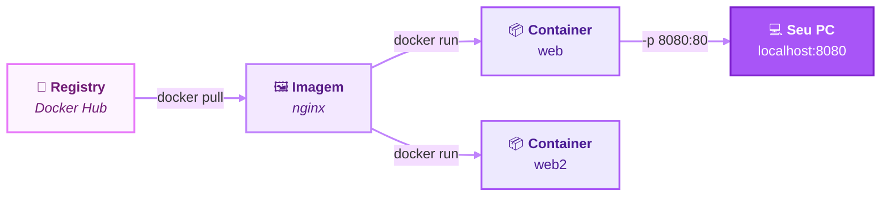

# 📦 01 · Containers

*Aprender • Construir • Quebrar • Consertar • Compartilhar*

---

## 🗂️ Nesta página

- [🤔 O que é?](#-o-que-é)
- [💡 Por que existe?](#-por-que-existe)
- [🔨 Hands-on](#-hands-on)
- [💥 O que quebrou?](#-o-que-quebrou)
- [🛠️ Como resolvi?](#️-como-resolvi)
- [🧠 O que aprendi?](#-o-que-aprendi)
- [📚 Referências](#-referências)

---

## 🤔 O que é?

### 📱 A analogia do smartphone

Pense nos apps do seu celular. Você nunca precisou instalar dependências ou configurar o sistema para um app funcionar: abre a loja, clica em instalar e pronto. Um app também não interfere no outro, porque cada um roda isolado.

  

Containers funcionam de forma parecida. Cada processo em container roda em um ambiente isolado, independente dos outros containers e do próprio host.

### 📖 Definição

Um **container** é uma **imagem em execução**: um processo isolado na sua máquina.

> ⚠️ **Container não é uma máquina virtual.** Ele não tem kernel próprio nem hypervisor. Ele compartilha o kernel do host e só enxerga o que foi isolado para ele.

| Conceito | Analogia | O que é |
|---|---|---|
| 🖼️ **Imagem** | O app na loja | O pacote com tudo que é preciso para rodar |
| 📦 **Container** | O app aberto | A imagem em execução, isolada |
| 📮 **Registry** | A loja de apps | Onde as imagens ficam guardadas (ex.: Docker Hub) |

> Uma mesma imagem pode gerar quantos containers você quiser, e cada um roda isolado dos outros.

---

## 💡 Por que existe?

Antes de containers, rodar uma aplicação em outra máquina exigia replicar manualmente todo o ambiente: a versão certa da linguagem, as bibliotecas certas, variáveis de ambiente e configurações do sistema. Daí nasce o problema mais clássico do desenvolvimento de software:

> **"Na minha máquina funciona."** 🙃

Containers resolvem isso porque:

| Problema | Como o container resolve |
|---|---|
| Instalar e configurar tudo à mão | A imagem já traz tudo pronto; basta um `docker run` |
| Conflito entre projetos na mesma máquina | Cada container roda isolado, com suas próprias versões |
| "Sujeira" deixada na máquina | Removeu o container e a imagem, não sobra nada |
| Ambientes diferentes entre dev, servidor e nuvem | A mesma imagem roda igual em qualquer lugar com Docker |

---

## 🔨 Hands-on

Para praticar este tema, fiz o lab **Meu primeiro container**: subi um servidor Nginx, explorei o container por dentro, quebrei coisas de propósito e consertei.

**Comandos essenciais do tema:**

| Comando | Para que serve |
|---|---|
| `docker run -d --name web -p 8080:80 nginx` | Cria e inicia um container |
| `docker ps` / `docker ps -a` | Lista containers rodando / todos, inclusive os parados |
| `docker logs web` | Mostra o que está acontecendo dentro do container |
| `docker exec -it web sh` | "Entra" no container |
| `docker rm -f web` | Remove o container |
| `docker rmi nginx` | Remove a imagem |

---

## 💥 O que quebrou?

| Quebra | O que aconteceu |
|---|---|
| Porta ocupada | Dois containers tentando usar a mesma porta do meu PC |
| Esqueci o `-p` | O container rodava, mas eu não conseguia acessar |
| Esqueci a senha do banco | O Postgres morria logo depois de subir |
| Os dados sumiram | Apaguei o container e a tabela foi junto |

➡️ Erros reais e detalhes no [lab completo](https://github.com/docker-journey/docker-labs/tree/main/lab-01-primeiro-container).

---

## 🛠️ Como resolvi?

- **Porta ocupada:** mapeei para outra porta do host (`-p 8081:80`). O conflito é no host, não no container.
- **Esqueci o `-p`:** recriei o container com port mapping. Sem ele, o isolamento de rede bloqueia o acesso.
- **Esqueci a senha:** usei `docker ps -a` e `docker logs` para descobrir o motivo, e passei `-e POSTGRES_PASSWORD`.
- **Os dados sumiram:** é o comportamento esperado. Containers são descartáveis, e a solução são os **volumes** (tema 04).

## 📚 Referências

- 🎥 Sessão **Docker Intro & Overview**, Michael Irwin (Docker)
- 🎓 [Docker Learning Path: Developer Basics, Build, Compose](https://www.docker.com/learning-paths/learning-basics/)
- 🐣 [Docker 101 Tutorial](https://www.docker.com/101-tutorial/)
- 🧰 [Play with Docker](https://www.docker.com/play-with-docker/)
- 🏪 [Imagem oficial do Nginx no Docker Hub](https://hub.docker.com/_/nginx)
- 🐘 [Imagem oficial do Postgres no Docker Hub](https://hub.docker.com/_/postgres)

---

⬅️ [Voltar para a trilha](../README.md) &nbsp;•&nbsp; [Próximo: 02 · Images](../02-images) ➡️

💜 *Docker Journey · Aprender. Construir. Quebrar. Consertar. Compartilhar.*

