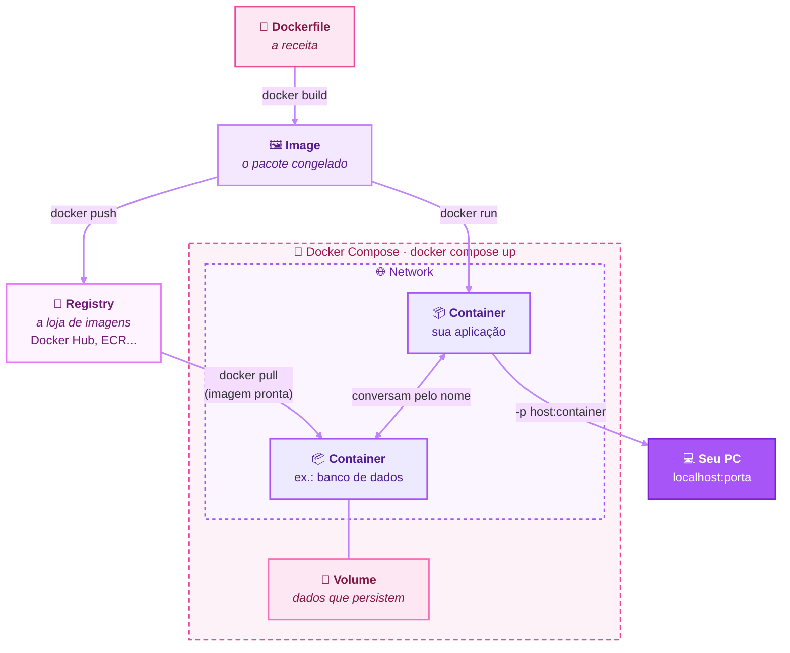

  

# 🔷 Docker: Overview

Este documento explica **O que é Docker** e **por que aprender Docker**, **o que é este
projeto**, e **cada arquivo** que o compõe - incluindo a ordem em
que eles dependem uns dos outros e o motivo dessa ordem.

---

  

## 1. Por que aprender Docker

Antes de containers, rodar uma aplicação em outra máquina exigia
replicar manualmente todo um ambiente: a versão certa da linguagem,
as bibliotecas certas, variáveis de ambiente, configurações do
sistema operacional. Isso gera o problema mais clássico do
desenvolvimento de software:

> "Na minha máquina funciona."

O Docker resolve isso empacotando a aplicação **junto com tudo que
ela precisa pra rodar** - sistema, linguagem, bibliotecas, código e
comando de start - em uma unidade só, chamada **imagem**. Essa
imagem roda de forma idêntica em qualquer lugar que tenha Docker
instalado: seu notebook, o servidor da empresa, a nuvem (AWS, GCP,
Azure), o notebook de outro desenvolvedor.

Por isso Docker é considerado uma habilidade básica em DevOps hoje:

- **Portabilidade** - o mesmo pacote roda igual em qualquer ambiente
- **Isolamento** - cada aplicação roda separada das outras, sem
  conflito de versões de bibliotecas entre projetos diferentes
- **Padronização de times** - todo mundo do time sobe o projeto com
  o mesmo comando, sem precisar seguir um manual de instalação
  manual, cheio de passos que variam por sistema operacional
- **Base para orquestração** - ferramentas como Kubernetes,
  usadas em produção em larga escala, funcionam gerenciando
  containers. Entender Docker é o primeiro degrau pra chegar lá
- **Ambientes de CI/CD** - pipelines de teste e deploy automatizado
  quase sempre rodam dentro de containers, justamente pela
  consistência que eles garantem

## 2. Os objetos do Docker

### 📜 `Dockerfile`
A "receita" que diz ao Docker como construir a imagem.
É lido de cima para baixo, e as instruções que alteram arquivos (`RUN`, `COPY`, `ADD`) viram camadas (layers).
Não roda nada sozinho: ele só serve de entrada para o `docker build`.

### 🖼️ `Image`
O "pacote de instalação": sistema, linguagem, bibliotecas, código e comando de start.
É imutável, como uma foto congelada, e é formada por camadas empilhadas.
Uma mesma imagem pode gerar quantos containers você quiser.

### 📦 `Container`
Uma imagem em execução: um processo isolado na sua máquina, não uma máquina virtual.
Como os apps do celular, cada container roda separado dos outros e do host.
Pode ser criado, parado e removido sem deixar nada instalado na máquina.

### 📮 `Registry`
O lugar onde as imagens ficam guardadas e são compartilhadas, como uma "loja de apps".
O mais conhecido é o Docker Hub, mas existem outros, como AWS ECR e JFrog Artifactory.
Você envia imagens com `docker push` e baixa com `docker pull`.

### 💾 `Volume`
Um espaço para guardar dados fora do container, que continua existindo mesmo se ele for removido.
Sem volume, tudo que o container grava some junto com ele.
É essencial para bancos de dados e qualquer dado que precise persistir.

### 🌐 `Network`
A rede que permite que containers conversem entre si pelo nome, mantendo o isolamento.
O port mapping (`-p 8080:5000`) é o que conecta uma porta do container a uma porta do seu PC.
Sem ele, a aplicação roda, mas você não consegue acessá-la de fora.

### 🧩 `Docker Compose`
Um arquivo YAML que descreve vários containers juntos: imagens, portas, variáveis e volumes.
É como escrever vários `docker run` de uma vez, em um só lugar.
Com `docker compose up`, o ambiente inteiro sobe com um único comando.

## 3. Fluxo visual

---

Se gostou, deixa uma ⭐

Feito com 💙 por RegiMaria

